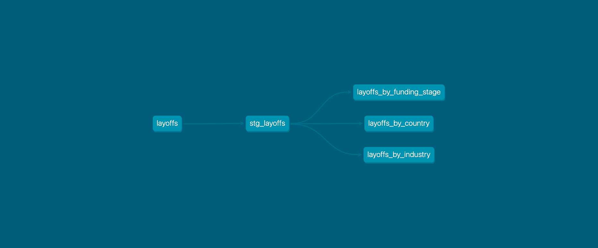

# Analysis of Layoff in Tech industry

## Context
Tech firms around the globe are fighting the economic slowdown. The slow consumer spending, higher
interest rates by central banks and strong dollars overseas are hinting toward a possible recession and
tech firms have started laying employees off. This economic slowdown has made Meta recently
firing 13% of its workforce, which amounts to more than 11,000 employees. This dataset was made with
the hope to enable Kaggle community to look into analyzing recent tech turmoil and discover useful findings.

Tracking the tech layoffs reported on the following platforms:
- Bloomberg
- San Francisco Business Times
- TechCrunch
- The New York Times

The data availability is from when COVID-19 was declared as a pandemic i.e. 11 March 2020 to present
(11 November 2022).

## Data Source
The source of the layoff dataset is [Kaggle](https://www.kaggle.com/datasets/swaptr/layoffs-2022). Startup layoffs as reported on Layoffs.fyi from COVID (11 March 2020) to today.

## Technologies
- Database: BigQuery
- Data Transformation Tool: dbt

## Analysis
Based on analysis I found in Kaggle, these are the transformations that will be applied on the staging model:

### Transformations in the staging layer:

- `industry`, `total_laid_off`, `percentage_laid_off`, `stage` and `funds_raised` columns contain null values
    - `industry` - Convert NULL to 'Unknown'
    - `total_laid_off` - Convert NULL to 0
    - `percentage_laid_off` - Convert NULL to 0
    - `stage` - Convert NULL to 'Unknown'
    - `funds_raised` - Convert NULL to 0
- Data types conversions:
    - `company` - VARCHAR
    - `location` - VARCHAR
    - `total_laid_off` - INTEGER
    - `percentage_laid_off` - FLOAT
    - `date` - TIMESTAMP
    - `stage` - VARCHAR
    - `country` - VARCHAR
    - `funds_raised` - FLOAT
- `location` - Convert 'SF Bay Area' to 'San Francisco'
- Generate an auto-incrementing identifier AS `id`
- Add `ingested_at` column that represents the timestamp at which the row was ingested by dbt.

### Business Metrics
Based on the operational data, I divided my analysis based on industry, country and stage. This
will allow seeing the number of layoffs by industry, country and company stage.

## Staging models
- `stg_layoffs` is the staging model. It bears a one-to-one relationship with the source data table
it represents.  It has the same granularity, but the columns have been renamed or recast.

## Marts models
- `layoffs_by_industry` is the model that aggregates the number of layoffs by industry.
- `layoffs_by_country` is the model that aggregates the number of layoffs by country.
- `layoffs_by_funding_stage`  is the model that aggregates the number of layoffs by funding stage.

## Data Lineage

