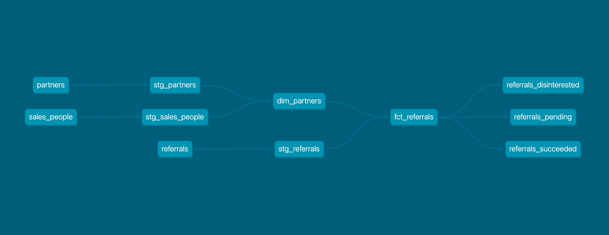
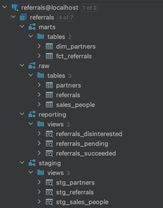

# Referrals Analysis and Modeling

## How to run it?

1. Create Python virtual environment and install all dependencies:

    ```python -m venv env```

    ```source env/bin/activate```

    ```pip install -r requirements.txt```


2. Initialize PostgreSQL container:

    ```docker-compose up```

3. Run and test dbt models on PostgreSQL database:

    ```./run.sh ```


## Business Context

The company currently has end-customers referred to us by partners, such as lettings agents and mortgage brokers.
The customer then signs up for our service, and we pay the partner a small commission per referrals.
Referrals are on a company level: a customer who signs up for five companies counts as five referrals.
Five customers in one company count as one referral.

Partners each have consultants, such as Joe Smith working at Lettings Agent A. The referrals are attributed
 to the specific consultant at a partner.

The data tables provided are as follows:

```
partners
	id
	created_at
	updated_at
	partner_type
  lead_sales_contact
```

```
sales people
  name
  country
```

```
referrals
	id
	created_at
	updated_at
  company_id
	partner_id
	consultant_id
	status
	is_outbound
```

For referrals, the `updated_at` field essentially says when the status went from `pending` to either
`disinterested` or `successful`. Timestamps are in Unix Nano format.

`is_outbound` is `true` when we refer a customer to a partner, i.e. "upsell". In this case we send
them the customer, and they pay _us_ a commission. We haven't done this very thoroughly yet, so most referrals are inbound.

Our sales people work in a "key account" model. Referrals come from partners, and a sales person
typically manages partner accounts.


## Index

1. [Analysis of data sources](#analysis-of-data-sources)
2. [Implementation of staging models for data sources](#staging-models)
3. [Definition of business questions/metrics](#business-metrics)
4. [Building of data models](#data-models)
5. [Improvements](#improvements)
6. [Limitations](#limitations)
7. [Suggestions](#suggestions)


## Analysis of Data Sources
The first step is the analysis and profiling of sources. The analysis is in [analyses](analyses)](analyses) folder. I chose Jupiter
Notebook because is the most simple tool to show an interactive data analysis.

I started to get the shape and column data types of the dataset, and after that, the data profiling. For that, I used
[Pandas Profiling](https://pandas-profiling.ydata.ai/docs/master/index.html) because is a great tool to get basic reports
for exploratory data analysis.

### Sales People
The Sales People source contains 2 columns and 12 rows.

The columns are:
- `name` is a categorical column that contains information about the name of the sales partner;
- `country` is a categorical column that contains information about the country to which each sales partner belongs to.
There are no missing values, and all the observations represent distinct values, meaning that does not exist duplicate rows.

The sales partners' names are:
- Orange
- Apple
- Lion
- Tree
- Root
- Sky
- Cloud
- Horiz
- Leaf
- Daisy
- Tulip
- Fig

The sales partners belong to the following countries:
- Singapore
- HongKong
- UK

In terms of frequency, 50% of the partners are based in the UK, 33.33% in Hong Kong and 16.7% in Singapore.

More details about this source can be found [here](analyses/sales_people_analysis.ipynb).

Based on that analysis, we can define a set of data quality validations for the `sales_people` source:
- `name` column should be unique, not null and have the following values: Orange, Apple, Lion, Tree, Root, Sky,
    Cloud, Horiz, Leaf, Daisy, Tulip and Fig
- `country` column should be not null and have the following values: Singapore, HongKong and UK

### Partners

The Partners source contains 5 columns and 522 rows.

The columns are:
- `id`: unique identifier of a partner - primary key;
- `created_at`: datetime in Unix nano format, which the partner was created on the system;
- `updated_at`: datetime in Unix nano format, which the partner was updated on the system;
- `partner_type`: categorical column, which represents the type of the partner;
- `lead_sales_contact`: categorical column, which represents the name of the sales partnership.

There are no missing values, and each observation represents a singular partner, meaning that, there are 522 partners distributed across different sales partnerships.

The types of partner types are the following:
- Agent
- IFA
- Developer
- Other
- Influencer
- Management company
- Lender
- Insurer

In terms of frequency, 67.2% of the partners are agents, 10.3% are IFA, and 5.9% are developers. The rest of 16.6% belongs to Other (4.8%), Influencer (4.4%), Management Company (3.4%), Lender (3.3%) and Insurer (0.6%).

The lead sales contact are the following:
- Sky
- Root
- Lion
- Tree
- Daisy
- Fig
- Horiz
- 0
- Leaf
- Cloud
- Apple
- Tulip
- Potato

Note that there is a lead sales contact that is not mapped on the sales_people table - '0'.

In terms of frequency, 23.0% of partners belong to Root lead sales contact, followed by Potato which represents 20.9%; Lion and Daisy with 8.8%; Apple with 8.2%; Sky with 7.1%; Tree with 6.9%; Leaf with 6.3%; Cloud with 3.8%; Horiz with 3.4%, and the remaining lead sales contact with 2.7%.

More details about this source can be found [here](analyses/partners_analysis.ipynb).


Based on that analysis, we can define a set of data quality validations for the `partners` source:
- `id` column should be unique and not null;
- `created_at` column should be not null;
- `updated_at` column should be not null;
- `partner_type` column should be not null, and have the following values: Agent, IFA, Developer,
Other, Influencer, Management company, Lender and Insurer;
- `lead_sales_partner` column should be not null and have the following values: Orange, Apple, Lion,
Tree, Root, Sky, Cloud, Horiz, 0, Leaf, Daisy, Tulip and Fig.

### Referrals

The Referrals source contains 8 columns and 1470 rows.

The columns are:
- `id`: unique identifier of a referral - primary key;
- `created_at`: datetime in Unix nano format, in which the referral was created on the system;
- `updated_at`: datetime in Unix nano format, in which the referral changed the status on the system;
- `company_id`: unique identifier of a company - foreign key;
- `partner_id`: unique identifier of a partner - foreign key;
- `consultant_id`: unique identifier of a consultant - foreign key;
- `status`: categorial column that contains the referral's status;
- `is_outbound`: boolean column; is `true` when the company refers a customer to a partner (upsell). In this case, the
partner pays a commission to the company.

There are no missing values, and each observation is a new referral made by a partner, that includes
details about the partner, consultant, status of the referral, etc.

Some findings found:
- The partners made referrals for 776 distinct companies;
- The referrals were made by 110 partners;
- There are 190 consultants across the partners;
- 59.7% of referrals were successful;
- 36.4% of referrals are pending;
- 3.9% of the customers classified the referral as disinterested;
- 63.4% of the referrals were made by partners;
- 36.6% of the referrals were made by the company to a partner (upsell).

More details about this source can be found [here](analyses/referrals_analysis.ipynb).

Based on that analysis, we can define a set of data quality validations for the `referrals` source:
- `id` column should be unique and not null;
- `created_at` column should be not null;
- `updated_at` column should be not null;
- `company_id` column should be not null;
- `partner_id` column should be not null;
- `consultant_id` column should be not null;
- `status` column should be not null and have the following values: successful, pending and disinterested;
- `is_outbound` column should be not null and have the following values: 0 and 1


## Staging models

### Staging model for Sales People

Based on that analysis, we can define a set of SQL transformations on the staging model:
- Add unique identifier
- Convert UK to United Kingdom
- Convert HongKong in Hong Kong
- Rename `name` to `lead_sales_name`
- Add `ingested_at` column that represents the timestamp at which the row was ingested by dbt

### Staging model for partners

Based on that analysis, we can define a set of SQL transformations on the staging model:
- Convert `created_at` column to human readable DateTime;
- Convert `updated_at` column to human readable DateTime;
- Convert IFA to Independent Financial Adviser;
- Rename `lead_sales_contact` column to `lead_sales_name`;
- Add `ingested_at` column that represents the timestamp at which the row was ingested by dbt.

### Staging model for referrals

Based on that analysis, we can define a set of SQL transformations on the staging model:
- Convert `created_at` column to human readable DateTime;
- Convert `updated_at` column to human readable DateTime;
- Convert `is_outbound` column to boolean logic;
- Add `ingested_at` column that represents the timestamp at which the row was ingested by dbt.


## Business Metrics

Based on the operational data, I defined referrals' performance as my analysis.
For that, I used referral status as the key to my analysis considering just "non-upsell" referrals.

The reason why chose that is because we can split referrals into three different statuses: succeded,
pending and disinterested.
From each status, we can get information at the level of partner, consultant, company, sales country,
and time.

On top of those, we can build interesting reports/dashboards, such as:
- How many succeeded referrals were made by partner
- How many succeeded referrals were made by consultant
- How many disinterested referrals were made by partner
- How many disinterested referrals were made by consultant
- How many pending referrals do we have grouped by partner
- How many pending referrals do we have grouped by consultant
- What are the partner's countries with more succeeded referrals
- What are the partner's countries with more disinterested referrals
- And so on.

These metrics will allow the company to monitor the performance of referrals in a detailed
grain.


## Data Models

The following image shows the DAG obtained:



- `stg_partners`, `stg_sales_people` and `stg_referrals` are the staging models. Each model bears a
one-to-one relationship with the source data table it represents. It has the same granularity,
but the columns have been renamed or recast.
- `dim_partners` and `fct_referrals` are the marts models. The `dim_partners` represents `partners`
business entity, and stores attribute about that. The `fct_referrals` represents the business process
of referrals.
- `referrals_disinterested`, `referrals_succeeded` and `referrals_pending` are the reporting models,
where each one represents a referral's status. These models already aggregate referrals by `partner_id`,
`consultant_id` and `company_id`, giving the total of referrals based on the status. I decided to add
this additional layer to become the model more related to the real business process and to facilitate the generation of
reports on a dashboard tool (avoiding complex data aggregations on the dashboard side).

The following image shows the database schemas:



- `raw`: contains tables with raw data;
- `staging`: contains staging models;
- `marts`: contains dim and fact models;
- `reporting`: contains BI models;


## Suggestions

Based on the [business metrics](#business-metrics) mentioned above, the company could get useful
insights from Referrals models, such as:
- Would be easier to define goals with partners;
- Find the root cause of disinterested referrals and discuss with the partners how to improve it;
- Identify possible bottlenecks on referrals that are delaying the customer decision;
- And so on.
